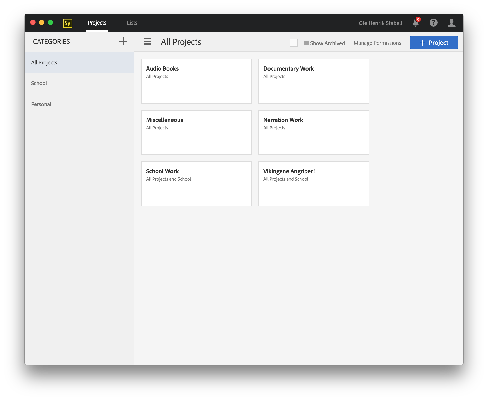

# Adobe Story Desktop App

This is an unoffical desktop app for the new HTML5 version of Adobe Story. It´s built using Electron.



It also tweaks a few things, like removing the obnoxious "Looking for the old version?" prompt from the top menu.

## Installation
You can download precompiled binaries for OS X, Windows and Linux in the [releases](https://github.com/Hennamann/Adobe-Story-Desktop-App/releases) section.

## Development Setup

1. Install [Node.js](https://nodejs.org/).
2. Install the depedencies, and start the app:

```sh
npm install
npm run start
```

## Compiling

### OS X
OS X has the advantage of being able to compile the OS X, Windows and Linux version of the app:

1. Install [Homebrew](http://brew.sh/)
2. Install `Wine` and `Makensis` which is needed for `electron-builder`.
```sh
brew install wine makensis
```
3. Install `electron-packager` and `electron-builder`.
```sh
npm install electron-packager --global && npm install electron-builder@1.1.0 --global
```
4. Run the build script for compiling all the binaries:
```sh
npm run pack:all
```
This will create a Windows installer, and create an OS X .dmg installer. (No Linux installer). The compiled binaries can be found in the releases folder.

If you just want to create a windows installer, or just an OS X installer, use these commands:

**Windows**
```sh
npm run pack:win
```
**OS X**
```sh
npm run pack:osx
```
### Windows
Windows can only compile binaries for Windows.
1. Install `electron-packager` and `electron-builder`.
```sh
npm install electron-packager --global && npm install electron-builder@1.1.0 --global
```
2. Run the build script for compiling the windows version:
```sh
npm run pack:win
```

### Linux
Linux can compile binaries for Linux and Windows.
1. Install `electron-packager` and `electron-builder`.
```sh
npm install electron-packager --global && npm install electron-builder@1.1.0 --global
```
2. Run the build script for compiling the linux and windows version:
```sh
npm run pack:win && npm run build:linux
```
## Contributing?
Want to contribute? Great!
If you found an issue, related to the app itself and not Adobe Story, submit it [here](https://github.com/Hennamann/Adobe-Story-Desktop-App/issues)!
Want to contribute code to the project? Just make a pull request, and if you´re code checks out we´ll merge it!

## License
[MIT](LICENSE.md)
