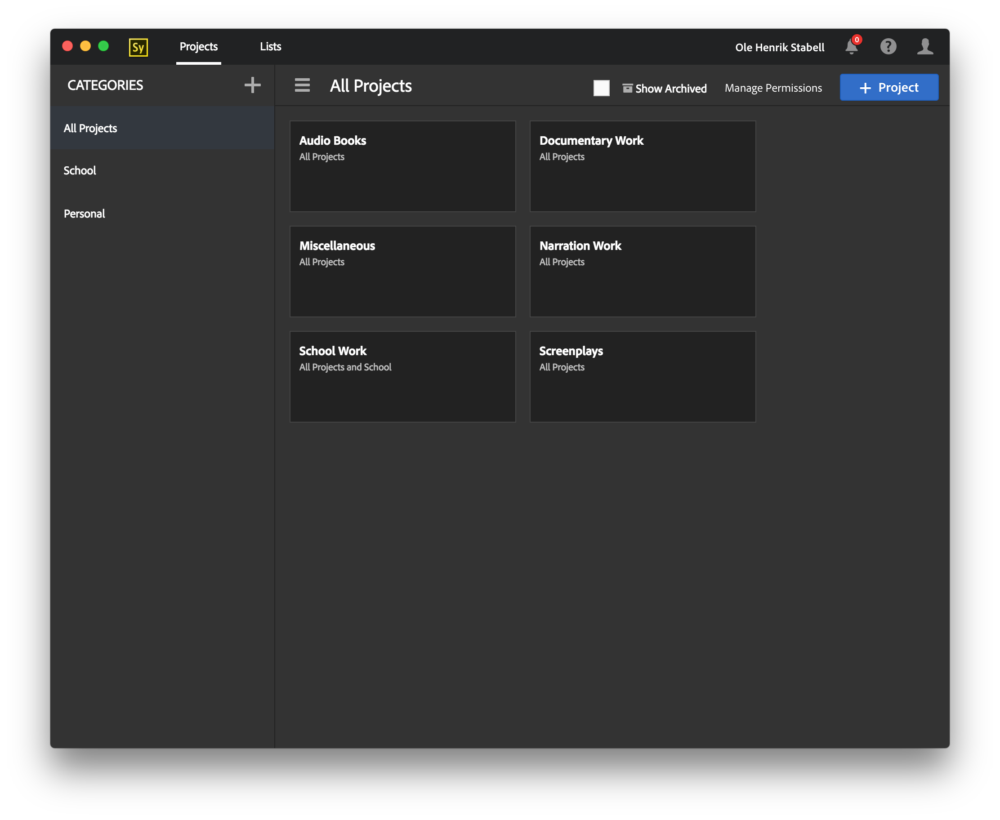

# Adobe Story Desktop App

**This project has been discontinued and is not supported, this is due to Adobe discontinuing both the old and new Adobe Story, for more info [check here](https://theblog.adobe.com/adobe-exits-scriptwriting-software-business-end-adobe-story-cc/)**

This is an unoffical desktop app for the new HTML5 version of Adobe Story. It's built using Electron. Along with providing a more native experience it also adds a dark design to the app.



It also tweaks a few things, like removing the obnoxious "Looking for the old version?" prompt from the top menu.

## Installation
You can download precompiled binaries for OS X, Windows and Linux in the [releases](https://github.com/Hennamann/Adobe-Story-Desktop-App/releases) section.

## Configuring
The app is set to use the dark mode by default, to return to the default design you need to modify the app's config file:

### OS X
Right click the app in Finder and choose "Show Package Contents" open the "Contents" folder and then open the "Resources" folder once inside, look for the folder labeled "app" once there you should find a file labeled: "config.json" edit it with something like TextEdit and change the "darkmodeEnabled" setting from "true" to "false". Save the file.
Next time you run the app it should be using the default design.

### Windows 
Head to your program files folder, and find the folder for "Adobe Story", open the "app" folder, once there you should find a file labeled: "config.json" edit it with something like Notepad and change the "darkmodeEnabled" setting from "true" to "false". Save the file.
Next time you run the app it should be using the default design.

## Development Setup

1. Install [Node.js](https://nodejs.org/).
2. Install the depedencies, and start the app:

```sh
npm install
npm run start
```

## Compiling

### OS X
OS X has the advantage of being able to compile the OS X, Windows and Linux version of the app:

1. Install [Homebrew](http://brew.sh/)
2. Install `Wine` and `Makensis` which is needed for `electron-builder`.
```sh
brew install wine makensis
```
3. Install `electron-packager` and `electron-builder`.
```sh
npm install electron-packager --global && npm install electron-builder@1.1.0 --global
```
4. Run the build script for compiling all the binaries:
```sh
npm run pack:all
```
This will create a Windows installer, and create an OS X .dmg installer. (No Linux installer). The compiled binaries can be found in the releases folder.

If you just want to create a windows installer, or just an OS X installer, use these commands:

**Windows**
```sh
npm run pack:win
```
**OS X**
```sh
npm run pack:osx
```
### Windows
Windows can only compile binaries for Windows.
1. Install `electron-packager` and `electron-builder`.
```sh
npm install electron-packager --global && npm install electron-builder@1.1.0 --global
```
2. Run the build script for compiling the windows version:
```sh
npm run pack:win
```

### Linux
Linux can compile binaries for Linux and Windows.
1. Install `electron-packager` and `electron-builder`.
```sh
npm install electron-packager --global && npm install electron-builder@1.1.0 --global
```
2. Run the build script for compiling the linux and windows version:
```sh
npm run pack:win && npm run build:linux
```

## ToDo
* Improve the darkstyle further.
* Improve the configuration system (Either relocate the config file, or add a config window in the app itself.).
* Add native keyboard shortcuts.
* Figure out a way to make it work offline (No idea how to even begin on that...).

## Notes
* This code is far from perfect, especially the styling, it's got some rough edges which i am still working on ironing out. The messy CSS is partly my fault as well as Adobe's (Their default CSS styling is also a mess...). 
* This project is not endorsed by Adobe in any way!

## Contributing?
Want to contribute? Great!
If you found an issue, related to the app itself and not Adobe Story, submit it [here](https://github.com/Hennamann/Adobe-Story-Desktop-App/issues)!
Want to contribute code to the project? Just make a pull request, and if you´re code checks out we´ll merge it!

## License
[MIT](LICENSE.md)
